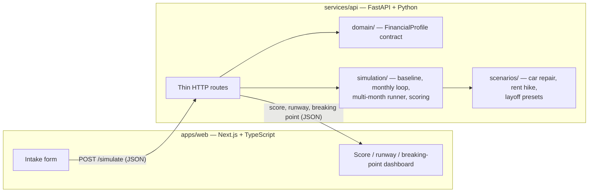
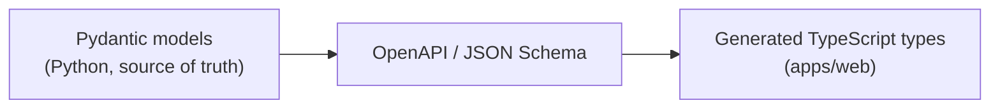
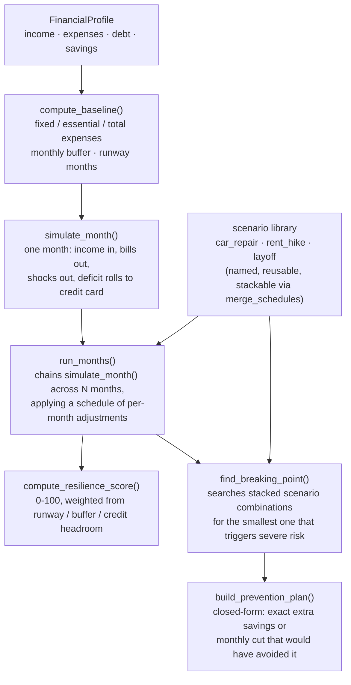

# BreakPoint

**A financial fire drill for renters and new grads — especially before signing a lease.**

A credit score tells institutions how risky you are to *them*. BreakPoint tells you how risky your life is to *you*.

BreakPoint is a deterministic financial-distress simulator. You give it a monthly budget (income, rent, debt, savings), and it stress-tests that budget against realistic emergencies — a car repair, a rent hike, a layoff, or several stacked together — and answers one question:

> **How many bad things can happen before this budget breaks?**

It is not a budgeting app, and it is not another "AI financial advisor" that guesses. Every number — the runway, the resilience score, the breaking point — comes out of plain, auditable Python math. The same inputs always produce the same outputs.

---

## Table of contents

- [Why this project exists](#why-this-project-exists)
- [Architecture](#architecture)
- [The simulation pipeline](#the-simulation-pipeline)
- [Core concepts](#core-concepts)
- [Repo layout](#repo-layout)
- [Build status](#build-status)
- [Running it locally](#running-it-locally)
- [Design decisions](#design-decisions)
- [Roadmap](#roadmap)

---

## Why this project exists

Most budgeting tools show you where money went. Almost none tell you how close you are to a financial cliff, or what specific combination of bad luck would push you over it. BreakPoint is built around a single non-negotiable rule:

> **The simulation engine calculates. The LLM (later) only explains. The frontend only shows.**

No model is ever allowed to invent a score, a runway estimate, or a breaking point — those are pure functions of the numbers you give it. This makes the tool auditable: every result can be traced back to a formula, not a guess.

## Architecture



Money is a **language-agnostic JSON contract**, not something owned by either side of the stack:



Why Python for the simulation core instead of doing it in TypeScript: the simulator is the actual product differentiator (not the form UI), and it's the natural home for the risk-modeling and ML work planned later (NumPy/SciPy/scikit-learn). One FastAPI backend, not a microservice zoo.

## The simulation pipeline

This is the core engine, in the order data flows through it:



**Worked example** — a $4,350/month take-home with $3,250 in monthly expenses has a $1,100 buffer. Run a `layoff` scenario (income → $0) for two months: month 1 drains savings and pushes the rest onto the credit card, month 2 goes fully to the credit card, month 3 (income restored) starts recovering. `find_breaking_point()` runs exactly this kind of search across combinations of presets — single shocks first, then pairs, then triples — until it finds one where the credit-card balance exceeds available credit (essentials can no longer be covered), or reports that the budget survived everything tried.

Once a breaking point is found, `build_prevention_plan()` answers "what would have prevented this" with two closed-form numbers derived from the exact dollar amount the credit balance overshot available credit by: the extra starting savings that would have absorbed it, and the permanent monthly spending cut (spread across the months leading up to the break) that would have absorbed it instead — capped against a feasibility check against actual discretionary + subscription spending, so it never recommends cutting more than the person actually spends. If the person's credit balance was already over their limit *before* any shock, the plan says so plainly instead of pretending savings could fix it — this engine never repays existing debt, so no future savings amount can undo a limit that's already blown.

**Scenarios are parameterized, not fixed presets.** `POST /simulate` takes a `scenarios` array of typed objects (`app/scenarios/schema.py`), each with its own amount and timing — a $340 rent hike starting next month is a different request from the default $200 one, not a different preset name. A `custom_shock` type is the escape hatch for anything that isn't a named preset at all (a pet emergency, a one-time fine): `{"type": "custom_shock", "monthIndex": 2, "name": "pet_emergency", "costCents": 40000}`. This is deliberately the same structured shape Phase 2's LLM layer will eventually populate from free text — "my rent just went up $340" becomes this JSON instead of a hardcoded preset pick, without the engine itself changing at all.

## Core concepts

| Term | Meaning |
|------|---------|
| **Baseline** | A normal month: income in, bills out, leftover |
| **Buffer** | Leftover cash after a normal month's expenses |
| **Runway** | Months of essential expenses covered by liquid savings |
| **Shock** | One emergency cost (car repair, medical bill) |
| **Scenario** | A named, reusable shock/income/expense pattern (layoff, rent hike) |
| **Stacked shocks** | Several scenarios overlapping in the same months |
| **Severe risk** | A month where even available credit can't cover the deficit |
| **Breaking point** | The smallest realistic combination of shocks that triggers severe risk |
| **Resilience score** | An explainable 0–100 score built from three weighted formulas — not a model's guess |
| **Prevention plan** | The exact extra savings or monthly cut that would have avoided a breaking point — closed-form, not a guess |
| **Deterministic** | Same inputs always produce the same outputs |

## Repo layout

```text
breakpoint/
├── apps/
│   └── web/                    Next.js + TypeScript UI (scaffolded, not yet built)
│       ├── components/
│       │   ├── intake/         financial input UI
│       │   └── dashboard/      score / runway / results UI
│       └── lib/api/            typed client calling FastAPI
│
├── services/
│   └── api/                    FastAPI + simulation engine
│       ├── app/
│       │   ├── domain/         FinancialProfile contract (Pydantic)
│       │   ├── simulation/     baseline, monthly loop, multi-month runner, scoring
│       │   ├── scenarios/      preset emergency library
│       │   ├── routes/         thin HTTP endpoints
│       │   └── main.py
│       └── tests/              engine tests — the critical coverage
│
├── packages/
│   └── contracts/              shared OpenAPI / JSON Schema artifacts (planned)
│
└── ARCHITECTURE.md             full architecture decision record
```

**Layer boundary rules**, enforced by convention: `apps/web` never contains score formulas or shock math; `services/api` routes never contain React, UI copy, or LLM prompts; `simulation/` is pure functions only — no network calls, no I/O.

## Build status

Phase 1 (deterministic simulator, no LLM yet) — see [ARCHITECTURE.md](ARCHITECTURE.md) for the full plan.

| Step | Piece | Status |
|------|-------|--------|
| 1 | `FinancialProfile` contract + validation | ✅ Done |
| 2 | Baseline math (buffer, runway, expenses) | ✅ Done |
| 3 | One-month simulation + one-time shocks | ✅ Done |
| 4 | Multi-month runner | ✅ Done |
| 5 | Scenario library (car repair, rent hike, layoff) | ✅ Done |
| 6 | Resilience score + breaking-point search | ✅ Done |
| 7 | `POST /simulate` HTTP endpoint | ✅ Done |
| 8 | `GET /health` | ✅ Done |
| 9 | Prevention/recommendation engine (extra savings, monthly cut) | ✅ Done |
| 10 | Next.js intake form + dashboard | ⬜ Not started |
| 11 | LLM explanation layer | ⬜ Not started (Phase 2, deliberately deferred) |

**Phase 1 complete end-to-end, plus a prevention layer beyond the original scope.** 37 automated tests, all passing — profile validation, baseline math, single-month simulation, the multi-month runner, every scenario preset (individually and stacked), the resilience score formula, the breaking-point search, the prevention engine (proven by re-simulating with its own recommendations applied), and the `/simulate` HTTP route itself (via FastAPI's `TestClient`).

## Running it locally

### Backend (FastAPI)

```bash
cd services/api
python3 -m venv .venv
source .venv/bin/activate
pip install -r requirements.txt

uvicorn app.main:app --reload --port 8000
# health check: http://localhost:8000/health
```

### Tests

```bash
cd services/api
source .venv/bin/activate
pytest -v
```

### Frontend (scaffold only, not yet wired to the API)

```bash
cd apps/web
npm install
npm run dev
# http://localhost:3000
```

## Design decisions

The full reasoning — why Python over a TypeScript-only stack, why money is stored in integer cents, why the simulator is pure functions with no I/O, what was explicitly rejected for Phase 1 (Plaid, auth, Postgres, LangGraph) and why — is documented in [ARCHITECTURE.md](ARCHITECTURE.md).

## Roadmap

1. **Next.js intake + dashboard** — a real form calling the API, rendering score/runway/breaking point.
2. **Phase 2 — Agent layer** — a conversational LLM that asks intake questions and explains *already-computed* results in plain English. It never invents the numbers.
3. **Phase 3 — Real data** — HUD Fair Market Rents / FRED context, optional Plaid connection.
4. **Phase 4 — Stickiness** — score history, "what changed" alerts, heavier modeling only if the product pulls for it.
