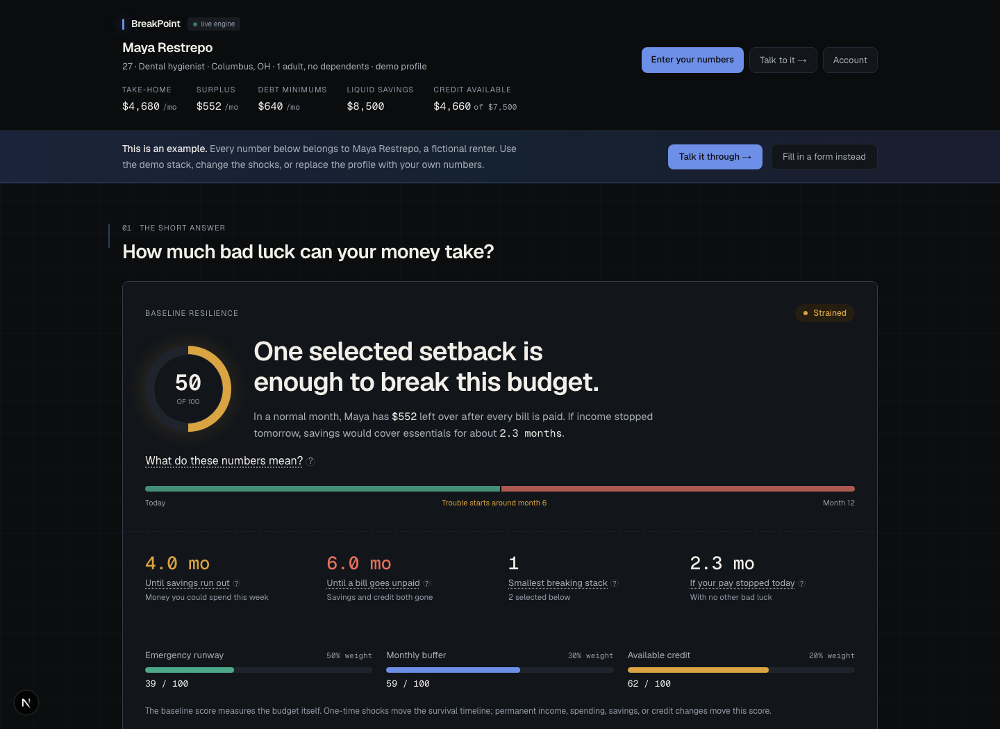
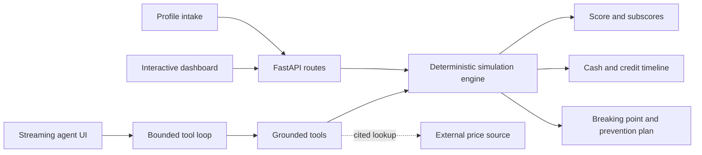

# BreakPoint

**A financial fire drill for renters and new graduates.**

[](https://github.com/gangisettyrushil10/Breakpoint/actions/workflows/ci.yml)
[](LICENSE)

> A credit score tells institutions how risky you are to them. BreakPoint tells
> you how much bad luck your own budget can absorb.

BreakPoint stress-tests a monthly budget against realistic emergencies, finds
the first month essentials would go unpaid, and calculates what would have
prevented it. Its conversational agent can explain and explore the result, but
it cannot invent financial figures: every number must come from a deterministic
tool result or it is regenerated or withheld.



## Try the demo

The repository ships with one fictional profile: **Maya Restrepo**, a
27-year-old dental hygienist in Columbus, Ohio.

1. Open the dashboard and notice the baseline score of **50/100**.
2. Select **Calm baseline**. Maya ends every normal month with a **$552** surplus.
3. Select **Demo stack**. A five-month layoff and $2,400 vehicle repair drain
   savings in month 4 and exceed available credit in month 6.
4. Open **Talk to it** and ask: `What would it take to get my score to 70?`

The target-planning tool searches the engine and finds the minimum verified
whole-dollar change for three pathways. For Maya, reaching 70 through savings
requires **$8,645** in additional liquid savings; the model does not calculate
that number.

## Why this project exists

Budgeting applications usually explain where money went. BreakPoint asks a
different question:

> How many ordinary setbacks can happen before this budget breaks?

That question requires two kinds of analysis that the product keeps separate:

- The **baseline resilience score** measures emergency runway, monthly buffer,
  and available credit.
- A **stress test** applies one-time or recurring shocks and projects cash,
  credit use, and unpaid obligations month by month.

A one-time repair should not silently change the underlying score. It changes
how long the budget survives. A permanent rent increase or income change can
move the score, so the agent prices those with a non-mutating `what_if` tool.

## Engineering highlights

### Deterministic core

All financial arithmetic lives in pure Python. Money crosses the API boundary
as integer cents, and identical inputs produce identical outputs.

The score is intentionally explainable:

```text
resilience = 50% emergency runway
           + 30% monthly buffer margin
           + 20% available-credit ratio
```

Six months of essential expenses and a 20% monthly buffer earn full points in
their respective components. The dashboard displays each subscore and weight.

### Grounded agent

The language model never receives the raw profile in its prompt. It can learn
financial values only by calling server-side tools. Every returned figure is
recorded in a grounding ledger, and outgoing sentences are checked against that
ledger before release.

- Unsupported figures trigger one regeneration attempt.
- A still-unsupported response is replaced with a ledger-built fallback.
- Streaming is sentence-gated, so an invented number is never briefly shown.
- Dangerous recommendations and requests for sensitive identifiers are blocked.
- The same simulation pipeline backs both the HTTP route and agent tool; a
  parity test prevents them from drifting.

### Agent tools

| Tool | Purpose | Writes profile | Network |
| --- | --- | ---: | ---: |
| `simulate` | Run baseline, selected shocks, or explicit breaking-point discovery | No | No |
| `explain_resilience_score` | Return score weights, components, and weakest factor | No | No |
| `plan_resilience_target` | Find minimum verified changes needed to reach a target score | No | No |
| `what_if` | Compare a permanent budget change without saving it | No | No |
| `estimate_commute_cost` | Price a commute from a cited current fuel price | No | Yes |
| `patch_profile` | Apply only user-confirmed profile changes | Yes | No |

External estimates are proposals, never silent profile updates. The agent must
show the source, date, and assumptions and wait for confirmation.

## Architecture



```text
breakpoint/
├── apps/web/                 Next.js, React, TypeScript, Recharts
│   ├── app/                  dashboard, intake, chat, account
│   ├── components/           product UI
│   ├── e2e/                  Playwright flows and accessibility checks
│   └── lib/                  API, storage, and Supabase adapters
├── services/api/             FastAPI and deterministic engine
│   ├── app/agent/            loop, tools, grounding, guardrails
│   ├── app/simulation/       pure financial calculations
│   ├── app/scenarios/        typed shock contracts and presets
│   └── tests/                engine, route, agent, and eval coverage
├── .github/workflows/ci.yml  full verification pipeline
├── render.yaml               API deployment blueprint
└── ARCHITECTURE.md           decisions and tradeoffs
```

The deeper decision record is in [ARCHITECTURE.md](ARCHITECTURE.md).

## Run locally

Requirements: Python 3.11+ and Node.js 20+.

**API**

```bash
cd services/api
python3 -m venv .venv
./.venv/bin/pip install -r requirements.txt
./.venv/bin/python -m uvicorn app.main:app --reload --port 8000
```

Copy `.env.example` to `.env` and add `OPENAI_API_KEY` to enable chat. The
deterministic dashboard remains fully functional without a model key.

**Web**

```bash
cd apps/web
npm ci
npm run dev
```

Open [http://localhost:3000](http://localhost:3000). If that port is occupied,
Next.js can use 3001; both are in the development CORS allowlist.

## Verification

```bash
# API: 298 deterministic, route, tool-loop, guardrail, and eval tests
cd services/api && ./.venv/bin/python -m pytest -q
./.venv/bin/python -m ruff check app tests

# Web: unit, static, production, security, and browser checks
cd apps/web
npm run lint
npm run typecheck
npm test
npm run build
npm audit --audit-level=high
npm run test:e2e
```

The Playwright suite runs desktop and mobile Chromium, exercises live shock
recalculation, checks all primary routes for horizontal overflow, and scans them
against WCAG 2 A/AA rules with axe-core.

## Deploy

### API on Render

The root [render.yaml](render.yaml) uses the production Dockerfile and `/health`
check. [Create the API from the Render Blueprint](https://render.com/deploy?repo=https://github.com/gangisettyrushil10/Breakpoint)
and provide:

```env
OPENAI_API_KEY=...
CORS_ALLOW_ORIGINS=https://your-project.vercel.app
```

Render supplies `PORT`; the container binds to it automatically.

### Web on Vercel

[Import the web app into Vercel](https://vercel.com/new/clone?repository-url=https%3A%2F%2Fgithub.com%2Fgangisettyrushil10%2FBreakpoint&root-directory=apps%2Fweb&env=NEXT_PUBLIC_API_URL),
keep the root directory as `apps/web`, and add:

```env
NEXT_PUBLIC_API_URL=https://your-api.onrender.com
```

After Vercel assigns the final URL, place that exact origin in Render's
`CORS_ALLOW_ORIGINS` and redeploy the API.

## Privacy and limitations

- Signed-out profiles and chats stay in browser storage. The API is stateless.
- Optional Supabase sign-in enables cross-device persistence with row-level
  security; it is disabled when keys are absent.
- BreakPoint is an educational stress-testing tool, not financial advice.
- The simulation covers a 1–12 month horizon and does not currently accrue
  interest, model taxes, or infer benefits eligibility.
- Location-based figures are never substituted without a source and explicit
  user confirmation.

## License

[MIT](LICENSE)
