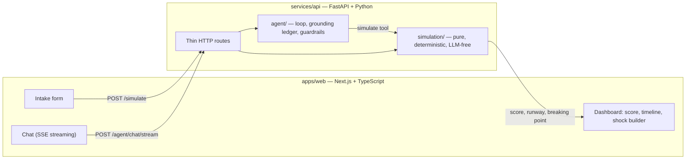
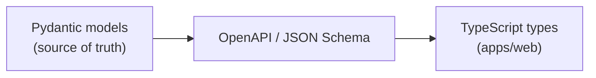
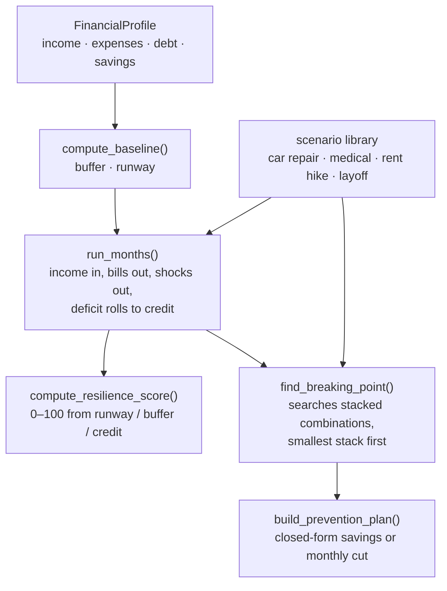

# BreakPoint

**A financial fire drill for renters and new grads — especially before signing a lease.**

> A credit score tells institutions how risky you are to *them*.
> BreakPoint tells you how risky your life is to *you*.

Most budgeting apps show you where your money went. BreakPoint answers a different question:

> **How many bad things can happen before this budget breaks?**

You give it a monthly budget. It stress-tests that budget against realistic emergencies — a car repair, a medical bill, a rent hike, a layoff, or several stacked in the same window — and finds the **breaking point**: the smallest combination of bad luck where essentials start going unpaid.

Then a chat agent explains the result in plain English. **The agent is structurally incapable of inventing a number** — it has no access to your budget except through a tool call into the deterministic engine, and an output guardrail withholds any reply containing a figure the engine didn't produce.

---

## Contents

- [Try it in five minutes](#try-it-in-five-minutes)
- [Demo persona: Devin Cross](#demo-persona-devin-cross)
- [What you should see](#what-you-should-see)
- [The engineering problem worth reading about](#the-engineering-problem-worth-reading-about)
- [Architecture](#architecture)
- [The simulation pipeline](#the-simulation-pipeline)
- [Core concepts](#core-concepts)
- [Repo layout](#repo-layout)
- [Testing](#testing)
- [Status](#status)
- [Known issues](#known-issues)

---

## Try it in five minutes

You need **Python 3.11+** and **Node 20+**. An OpenAI key is optional — without one, the dashboard and the whole deterministic engine still work, and only the chat tab degrades with a clear message.

**Terminal 1 — the engine:**

```bash
cd services/api
python3 -m venv .venv && source .venv/bin/activate
pip install -r requirements.txt

cp .env.example .env      # optional: add OPENAI_API_KEY for the chat agent
uvicorn app.main:app --reload --port 8000
```

**Terminal 2 — the UI:**

```bash
cd apps/web
npm install
npm run dev
```

Open **http://localhost:3000**. Health check: `curl localhost:8000/health`.

> If port 3000 is taken, Next.js falls back to 3001 — already in the API's CORS allowlist, so it just works.

Accounts are **optional and off by default**. With no Supabase keys the app runs exactly as it always has and nothing leaves your browser. To enable sign-in and cross-device saving, see [Optional: accounts](#optional-accounts).

---

## Demo persona: Devin Cross

Don't invent numbers — you'll usually land somewhere boring. Type **these** into the intake form at `/intake` and you'll see the product make its point.

> **Devin Cross**, 26, veterinary technician in Charlotte, NC. Single, no dependents, salaried and not worried about their job. Renting, about to re-sign a lease. On paper Devin is *fine* — they save money every single month.

**Household**

| Field | Value |
|---|---|
| City / State / ZIP | Charlotte / NC / 28205 |
| Dependents | 0 |
| Job stability | Stable — salaried or long-tenured |
| Pay frequency | Every two weeks |

**Income**

| Field | Value |
|---|---|
| Monthly take-home | `4120.00` |

**What goes out each month**

| Field | Value |
|---|---|
| Rent or mortgage | `1690.00` |
| Utilities | `145.00` |
| Groceries | `420.00` |
| Transportation | `295.00` |
| Insurance | `165.00` |
| Other essential | `80.00` |
| Subscriptions | `65.00` |
| Spending money | `310.00` |

**Debt and credit cards**

| Field | Value |
|---|---|
| Smallest payment you must make each month | `260.00` |
| Credit card balance | `2850.00` |
| Available credit | `5500.00` — enter your **total credit line** here, see [Known issues](#known-issues) |
| Credit card APR | `24.99` |

**Savings**

| Field | Value |
|---|---|
| Savings you could reach this week | `3400.00` |

---

## What you should see

Devin banks **$690 every month** and has never missed a bill. The dashboard says:

| | |
|---|---|
| **Resilience score** | **48 / 100** |
| Monthly buffer | **+$690** |
| Emergency runway | **1.11 months** |

The dashboard opens with **Layoff** and **Vehicle repair** already switched on. Use the shock builder to turn things on and off one at a time — every number on the page is recalculated each time.

| What you switch on | Result |
|---|---|
| Vehicle repair, $2,400 | survives |
| Medical expense, $1,800 | survives |
| Rent increase, +$250/mo for the rest of the year | survives |
| **Layoff** | **a bill goes unpaid in month 5, $1,490 past the credit line** |

**One job loss is the entire story.** Every other setback on that list, Devin absorbs without blinking — and the layoff still breaks them *even though the model assumes $1,200/month of replacement income coming in the whole time.*

The prevention plan then prices the escape: **$1,490 saved up beforehand, or $248/month cut** for the five months leading up to it. Devin's entire subscriptions-and-spending-money budget is **$375/month**, so it is *just* possible — it costs them two-thirds of everything discretionary, for most of a year, to survive one ordinary event.

That is the thesis of the product in one screen: **a person who saves money every single month, has never missed a payment, and would look completely fine to any credit model is one ordinary event away from the edge.**

> **A quirk worth knowing:** switch *every* shock off and the page still reports a breaking point. An empty shock list is the signal for the engine to go hunting on its own — it searches its built-in presets for the smallest thing that would break you, and reports that instead of a calm baseline. See [Known issues](#known-issues).

Finally, open the chat tab and ask:

> *"How many bad things can happen to me before I'm in real trouble?"*

The agent calls the engine and answers from the result — never from its own arithmetic:

> **One major bad event can put you in real trouble: a layoff.** In the stress test, a layoff beginning in the second projected month caused your credit-card balance to exceed available credit by **$810.00** — the point where essentials would start going unpaid.
>
> Your normal monthly buffer is **$690.00**, but your liquid savings provide only about **1.11 months** of essential-expense runway.
>
> The prevention plan says you'd need **$810.00 more in savings**, or a monthly reduction of **$405.00**. Your currently cuttable subscriptions and discretionary spending total **$375.00 per month**, so cutting only those would not quite meet the target.

Try `"What if I lose my job and it takes 4 months to find work?"` too — the agent turns free text into a **typed scenario** (`{"type":"layoff","startMonth":0,"durationMonths":4}`), re-runs the engine, and reports the new breaking point.

---

## The engineering problem worth reading about

The interesting part of this repo is not the financial math. It is **constraining a language model so that it cannot fabricate**, while still letting it hold a natural conversation.

**The model has no data.** It never receives the budget. Its only route to any figure is a `simulate` tool call that runs the same deterministic pipeline as `POST /simulate` — a test asserts the tool and the HTTP route produce byte-identical output for identical input.

**A grounding ledger decides what a reply may say.** Every figure the engine returned is recorded; the reply is diffed against that ledger. A number that isn't in it is ungrounded.

**Ungrounded replies are regenerated or withheld — never patched.** An earlier design rewrote bad numbers in place. An audit found that this fabricated *new* wrong numbers, so it was replaced wholesale.

**Streaming without weakening the guarantee.** Naively streaming tokens puts fabricated figures on screen before any check runs. Instead, the guardrails were already sentence-scoped pure functions, so they run incrementally per completed sentence and gate its release. A property test pins that the incremental and batch judgements are identical under arbitrary chunk boundaries — and the terminal `done` frame is authoritative, so the client discards everything streamed. That reduces a whole class of risk to one equivalence test.

**The eval set tests permission, not just prohibition.** It caught a guardrail blocking `401(k)` as an ungrounded number — a false positive that would have stopped the agent giving the exact safety advice it exists to give.

Full reasoning, including what was deliberately rejected, is in [ARCHITECTURE.md](ARCHITECTURE.md).

---

## Architecture



The hard boundary between `simulation/` and `agent/` is the main structural decision in the project: **the engine has no idea the agent exists.**

Money is a language-agnostic JSON contract in **integer cents**, owned by Python:



## The simulation pipeline



Cash and credit are tracked **separately and on purpose**: credit *delays* a failure rather than preventing one, so running out of cash and running out of credit are two distinct events with two distinct markers on the timeline.

## Core concepts

| Term | Meaning |
|------|---------|
| **Baseline** | A normal month: income in, bills out, leftover |
| **Buffer** | Leftover cash after a normal month |
| **Runway** | Months of essential expenses covered by liquid savings |
| **Shock** | One emergency cost |
| **Scenario** | A typed, parameterized shock pattern — a $340 rent hike is a different *request*, not a different preset |
| **Breaking point** | The smallest realistic combination of shocks where essentials go unpaid |
| **Resilience score** | An explainable 0–100 from three weighted formulas — never a model's guess |
| **Prevention plan** | The exact extra savings or monthly cut that would have avoided it, checked for feasibility |
| **Deterministic** | Same inputs always produce the same outputs |

## Repo layout

```text
breakpoint/
├── apps/web/                  Next.js + TypeScript UI
│   ├── app/                   dashboard · intake · chat · account
│   ├── components/            dashboard, chat, intake
│   ├── lib/                   typed API client, storage, supabase
│   └── tests/                 vitest — persistence contract
│
├── services/api/              FastAPI + the engine
│   └── app/
│       ├── domain/            FinancialProfile contract (Pydantic)
│       ├── simulation/        pure functions — no network, no LLM
│       ├── scenarios/         typed shock library
│       ├── agent/             loop · grounding · guardrails · tools
│       └── routes/            thin HTTP endpoints
│
├── supabase/migrations/       optional accounts + persistence
└── ARCHITECTURE.md            full decision record
```

**Boundary rules:** `apps/web` never contains score formulas or shock math. `simulation/` is pure functions — no network, no I/O, no LLM.

## Testing

```bash
cd services/api && source .venv/bin/activate && pytest    # 241 tests
cd apps/web && npm test                                   # 24 tests
```

The agent suite runs the **full agent loop against a scripted model** — no network, no API key, no flake. Guardrails are covered by an adversarial eval set that tests both prohibition and permission.

## Status

| Phase | Scope | Status |
|---|---|---|
| 1 | Deterministic engine, `POST /simulate`, dashboard | ✅ Complete |
| 2 | Chat agent, tools, guardrails | ✅ Complete |
| 2.5 | Grounding ledger, availability + deploy safety | ✅ Complete |
| 2.6 | Shared profile, intake form, SSE streaming, eval set | ✅ Complete |
| 2.7 | Optional accounts, Postgres persistence, RLS | ✅ Complete |
| 3 | Research tools — gas prices, Fair Market Rents, local events | ⬜ Not started |

## Optional: accounts

Signed out, everything stays in the browser — that is the default and it is a deliberate privacy property for financial data. To enable cross-device saving, create a Supabase project and add to `apps/web/.env.local`:

```env
NEXT_PUBLIC_SUPABASE_URL=
NEXT_PUBLIC_SUPABASE_PUBLISHABLE_KEY=
```

Then apply the schema with `supabase db push`. The profile and chat transcript are stored per user under row-level security, with no public read path. Sign-in is at `/account`.

## Known issues

- **`availableCreditCents` is read two different ways.** The breaking-point search ([`scoring.py`](services/api/app/simulation/scoring.py)) and the prevention plan treat it as the **total credit line**, while the resilience subscore, the dashboard's `creditLimitCents`, and the intake form's own hint treat it as **remaining headroom**. Until this is reconciled, enter your total credit line in that field — following the form hint instead can report a breaking point in month 0 before any emergency is applied.
- **An empty shock list means "go hunting", not "no shocks".** Switching every toggle off sends `scenarios: []`, which makes the engine search its own presets for the smallest thing that would break you — so the page reports a breaking point when the user believes they asked for a calm baseline. The two states need to be told apart.
- **The engine presets and the dashboard's shocks disagree.** The built-in preset layoff is 2 months with no replacement income; the dashboard sends 5 months with $1,200/mo. Both are defensible, but the same person gets two different breaking points depending on which path ran, and neither screen says which assumptions were used.
- **The preset stress test is gentle.** That 2-month preset layoff means the open-ended "what would break me?" search can report no breaking point for someone with barely a month of runway. When nothing breaks, the reply should name what was actually tested.

## License

[MIT](LICENSE)
